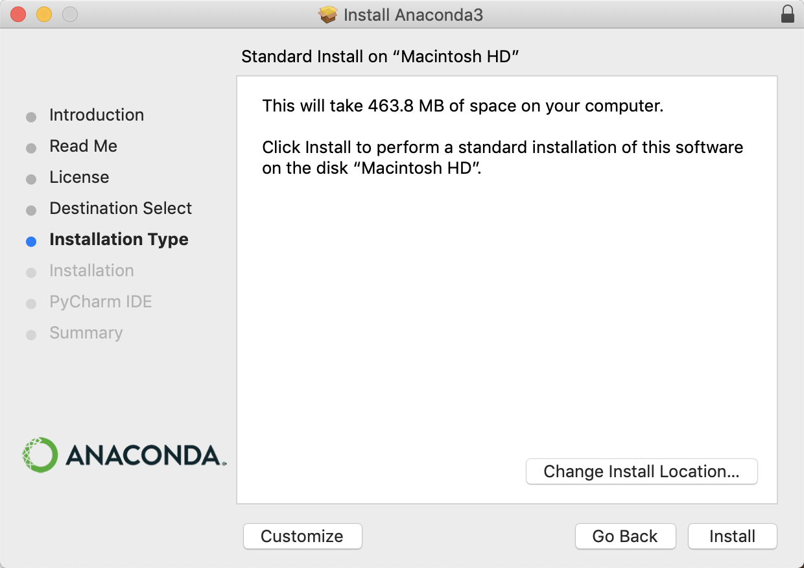
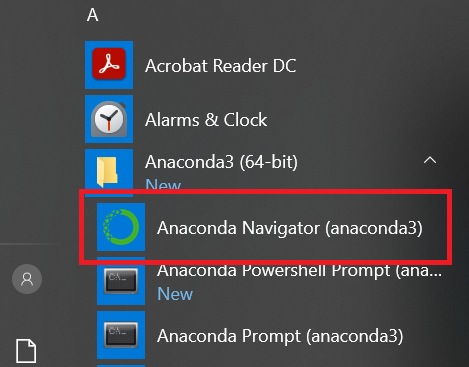
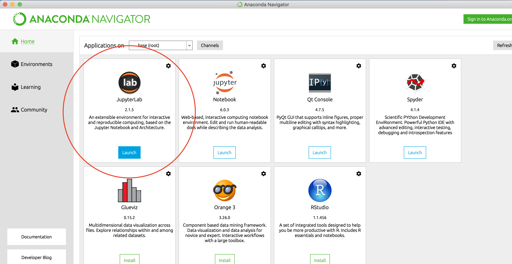
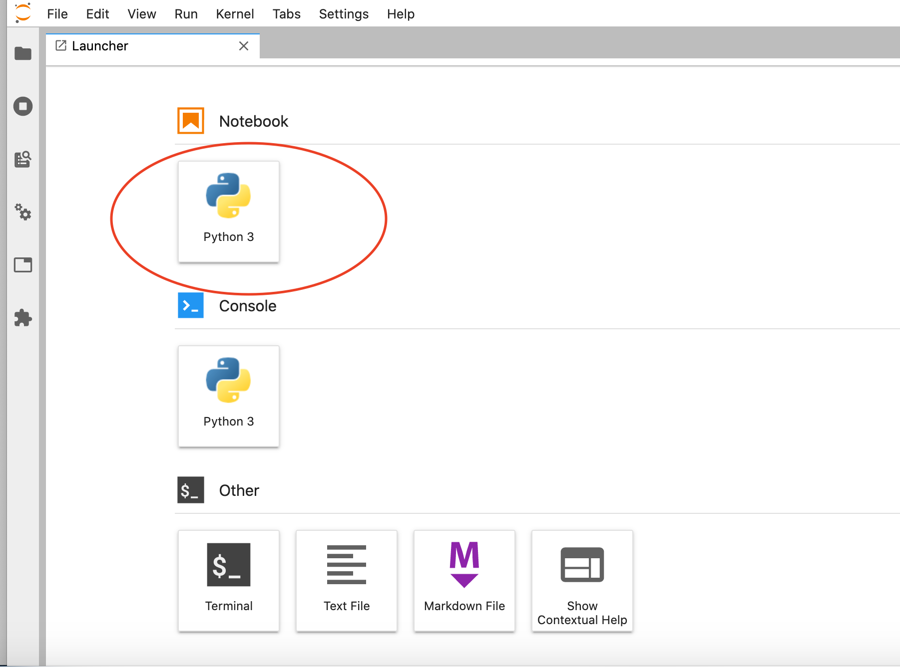

# Homework 2

This week's homework has two main goals: to finish up our introductory command line exercises and to getting us all set up to start experimenting with Python –– a programming language that we'll be using to build on the skills for analyzing texts that we began to develop using the command line interface.  Don't be alarmed by the length of this homework––part 2 is simply a series of detailed instructions on how to install the correct distribution of Python, which will make it much easier for all of us to work in the same coding environment.  

The only written part that I'll ask you to turn in is Part 1, but please make sure that you have Anaconda installed (and have read through the appropriate materials from part 3) prior to our class on Thursday.

- [PART 1: Finishing up in-class command line exercises]
- [PART 2: Installations]
- [PART 3: Working with Python in Jupyter Notebooks]

## PART 1: Finishing up in-class command line exercises

1. Together with your **partner**, finish the [in-class exercises from Thursday, Feb. 11](https://github.com/sceckert/IntroDHSpring2021/blob/main/_week2/in-class-exercises.md).
2. Type up the commands you write to each of the questions.

Remember, these exercises draw on the commands you learned:

- The *Programming Historian* ["Introduction to the Bash Command Line" tutorial](https://programminghistorian.org/en/lessons/intro-to-bash)
- Our in-class [introduction to the command line](https://github.com/sceckert/IntroDHSpring2021/blob/main/_week2/introduction-to-the-command-line.md).
- Our command line [cheatsheet](https://github.com/sceckert/IntroDHSpring2021/blob/main/_week2/command-line-cheat-sheet.md). 

## PART 2: Installations  

### Installing Anaconda

In this course, we're going to be working primarily with Python.[^1] While there are a number of ways to install Python, we're going to install the latest version of Python 3 using Anaconda. Anaconda is a Python distribution that comes with other really useful data science packages as well as the open-source web application, Jupyter Lab and Jupyter Notebooks (more on that in a bit). Not only does Anaconda have We'll be using in this course.

### Step 1: Install Anaconda

1. Go to [the Anaconda website](https://www.anaconda.com/products/individual). Scroll down to the bottom of the page to find the downloader for your operating system. Find your operating system, and click on the link to download the installer. Unless you're already very comfortable using the command line, you should choose the "Graphical Installer" version, which will allow you to navigate Anaconda through an app-like interface called **Anaconda Navigator**.  

2. Once you click on the link, follow the instructions to open the installer, and follow the installer directions. 
	- For Mac OS: Select "Install for me only" when prompted to select a destination (If you get an error message, re-select "Install for me Only") 
	- For Windows: Select "Just Me," then select a destination folder to install Anaconda (this folder name should not contain any spaces) 
	- For Linux, you will not have the option to install the Graphical installer. Instead, follow the instructions for your Linux distribution here: [https://docs.anaconda.com/anaconda/install/linux/](https://docs.anaconda.com/anaconda/install/linux/)

3. Anaconda will ask whether you want to add Anaconda to your PATH environmental variable. You don't have to do this, since you will be able to launch Anaconda through a graphical interface (like you would any other application). By adding Anaconda to your PATH, you will be able to launch Jupyter notebooks from the command line as well as from the Anaconda Navigator interface.

3. Once you have downloaded Anaconda, verify your installation: [https://docs.anaconda.com/anaconda/install/verify-install/](https://docs.anaconda.com/anaconda/install/verify-install/)

#### Step 2: Launch Anaconda ####

Launch Anaconda Navigator as you would any app.

- For Mac OS, navigate to your "Applications" folder, then click on the Anaconda Navigator icon (or search "Anaconda Navigator" in Finder)

- For Windows: Navigate to the Windows start menu. "Start" > "Anaconda4 (64-bit)"  >  "Anaconda Navigator" 

You should see the following Anaconda Navigator menu:

#### Step 3: Installing a Text Editor 

We are going to be working with plain text files. While you can certainly use default text applications on your machines, such as Notepad (Windows) or TextEditor (Windows), it helps to have an editor better suited to handling text files that include some code. BBEDit and Atom are both good open-source text editors. Choose one to install: 

- To download BBEDit, go to the download page: [https://www.barebones.com/products/bbedit/]index.html and select the free version
- To download Attom, visit the download page, and then follow [the download instructions](https://flight-manual.atom.io/getting-started/sections/installing-atom/) for your operating system.

## PART 3: Working with Python in Jupyter Notebooks

1. Launch Anaconda Navigator
2. Click on the "Launch" button under JupyterLab 
3. Create a new Jupyter notebooks by clicking on the Python 3 icon under "Notebook" 
3. Finally, once you have your new notebook open, read Melanie Walsh's ["How To Use Jupyter Notebooks" (2020)](https://github.com/melaniewalsh/Intro-Cultural-Analytics/blob/master/book/Python/How-to-Use-Jupyter-Notebooks.ipynb)

[^1]: Why Python? One reason is that it's flexible and popular within digital humanities research. Take a look at ["Which DH Tools Are Actually Used in Research?"](https://weltliteratur.net/dh-tools-used-in-research/) (Dec. 6, 2019), a study by Laure Barbot, Frank Fischer, Yoann Moranville and Ivan Pozdniakov, which looks at tools mentioned in the DH conferences, ADHO between 2015-2019