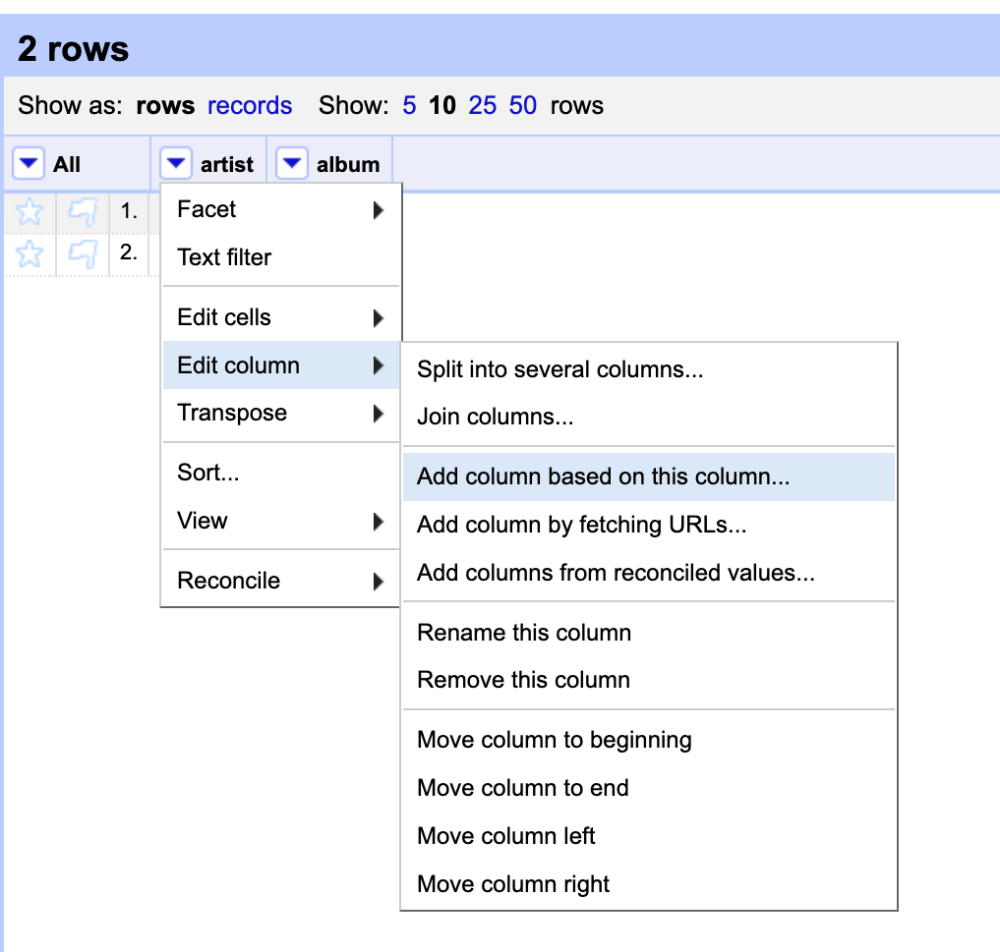
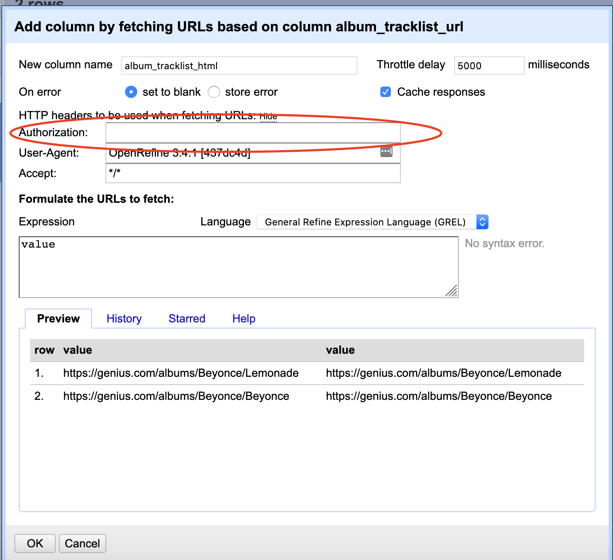
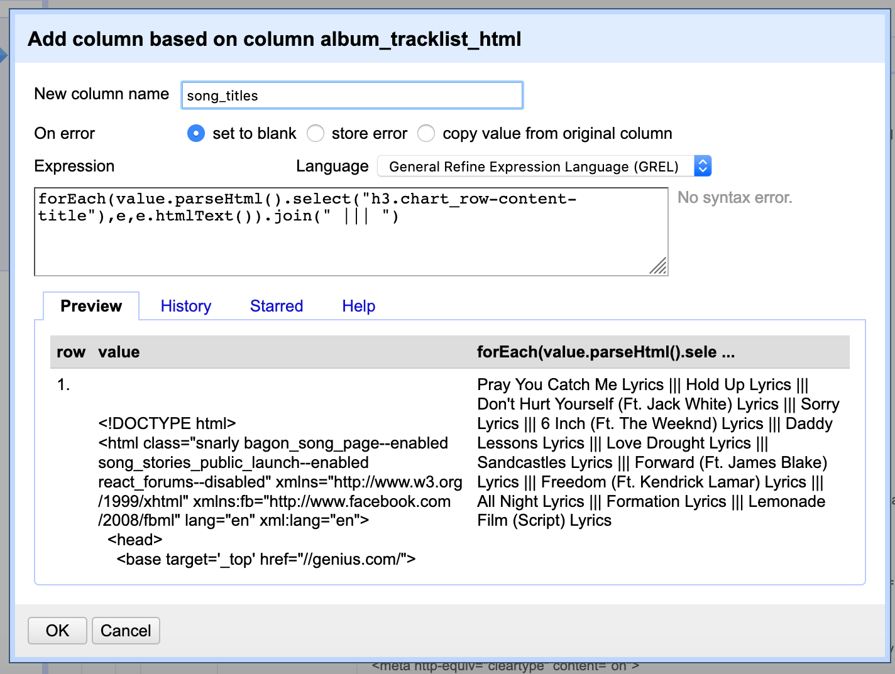
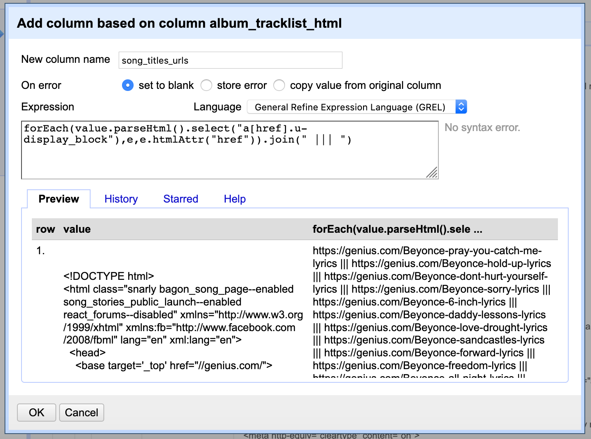
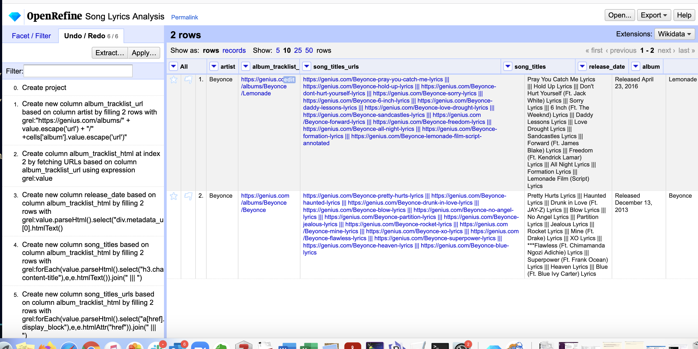
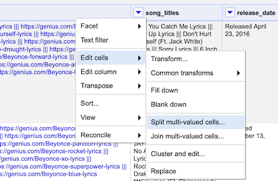
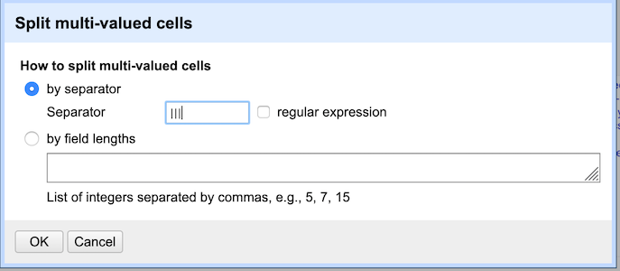

# Web-scraping and OpenRefine

Thursday, March 11


### Thursday, March 11


## What is HTML?

```
	<!DOCTYPE html>
	<html>
	<body>
	<h1> This is header </h1>
	<p> This is a paragraph </p>
	<p> Paragraph with a <a href="https://sceckert.github.io/IntroDHSpring2021/">link.</a></p>
 	</body>
	</html> 
```


### Exercise: Make your own HTML page

Open a text editor (TextEdit, Notepad, BBEdit, Atom), and type the following:

```
	<!DOCTYPE html>
	<html>
	<body>
	<h1>[Your name here]'s First Heading</h1>
	<p>[Your name here]'s first paragraph.</p>
	<p> Here's a <a href="https://sceckert.github.io/IntroDHSpring2021/">link.</a> to our course.</p>
	</body>
	</html> 
```

Save the file as `my_webpage.html` 


Click on your file (`my_webpage.html`) to open it. It should open in a web browser.

Open up the Web Inspector (or Inspector), take a peek under the hood.

- **Safari**: Click on the "Develop" menu and select "Show Web Inspector", 
- **Firefox**: Click on the "Tools" menu and select "Web Developer", 
- **Chrome**: Click on the "View" menu and select "Developer" and then select "Inspect Elements" 

Hover over the part of the page. What do you notice?


## What is OpenRefine?


Note: 
OpenRefine as a way to clean, sort and explore your data. It's not quite as powerful as Pandas and Python, for sorting and analyzing data but it does allow you to interact with a more user-friendly interface. 

What can you do with Open Refine?

You can filter text (show text filter)

You can facet (show facet)

And it can be REALLY handy for collecting data that is stored in webpages. 


## Case Study: Web-scraping Song Lyrics from Genius


**What if you wanted to analyze all of the songs by a particular artist?** 

How would you do it?

Note:
You could try to type them out!
Or you could try to partially automate the process.


**Let's look at the URL for Beyoncé's album, *Lemonade* (2016)**

[https://genius.com/albums/Beyonce/Lemonade](https://genius.com/albums/Beyonce/Lemonade)


**Compare with the URL for Beyoncé's album, *I Am...Sasha Fierce* (2008)** 
https://genius.com/albums/Beyonce/I-Am-Sasha-Fierce

What do you think the URL would look like for her album, *B'Day* (2006)?

Note:
We now have enough information to try and compile a list of artist and albums. We're going to work with a very small demo collection (to save time), but this method could be scaled up.


1. Open OpenRefine
2.Under "Get data from," select Clipboard. Paste the following text into the clipboard and hit enter:
<section>
  <pre><code>
artist, album
Beyonce, Lemonade
Beyonce, Beyonce
  </code></pre>
</section>

3. Click "Create Project" 

 


### Using a spreadsheet to generate a URL

OpenRefine lets you create new columns based on data in existing columns.

Because we know that Genius URLs for follow a standard convention, we can use this feature to turn our little spreadsheet of artist and album names into URLs that we could use to download the source code of those pages.

4. Click on the triangle in the "artist" column, and select "Edit column" and then, "Add column based on this colum..." 

 


5. In the box that appears, enter "album_tracklist_url" for the new column name. Then, we're type in some lightweight code to take the values from our columns **artist** and **album** and turn them into parts of URLs. Paste the code below into the Expression box
<section>
  <pre><code>
	"https://genius.com/albums/" + value.escape('url') + "/" +cells['album'].value.escape('url')"
  </code></pre>
</section>

(

Note:
Here, we're using a language called General Refine Expression Language to stitch together a URL: the first part "https://genius.com/albums/" is part the, `value` is a pre-sent variable -- it takes whatever value is in the starting column. We do the same thing to the `value` in the column labeled `Album`

We should get something like: https://genius.com/albums/artist_name/albumn_name


### Using a URL to download an HTML page

6. Click on the triangle in the "album_tracklist_url" column, and select "Edit column" and then, "Add column by fetching URLs...". 

7. Then, enter "album_tracklist_html" for the new column name and paste the following text in the window. 
<section>
  <pre><code>
	value
  </code></pre>
</section>


But we're not quite done!  In order to download webpages from the Genius API, we need to enter our secret Client Access Token



### Extracting links and metadata from an HTML page

**OK––we have our HTML!!**  Now let's try to get some information out of it.

First, let's look back at the page source for Beyoncé's, *Lemonade*,  & find the part of the HTML encoding the release date, so that we can get this piece of information into our spreadsheet.


Go to https://genius.com/albums/Beyonce/Lemonade 

Open up the Web Inspector. 

- **Safari**: Click on the "Develop" menu and select "Show Web Inspector", 
- **Firefox**: Click on the "Tools" menu and select "Web Developer", 
- **Chrome**: Click on the "View" menu and select "Developer" and then select "Inspect Elements" 

Hover over the part of the page with the release date. 

What is the element?

Note: 
We can USE the tag to extract just this piece of information in our spreadsheet


ANSWER:

The HTML element labeling the release date is:
<section>
  <pre><code>
	div.metadata_unit
  </code></pre>
</section>


Now, staying on the https://genius.com/albums/Beyonce/Lemonade page:
- find the HTML elements for **the song titles** 
-  find the HTML elements for **the url links to the song lyrics pages**

What are they?


ANSWER:

For the song titles, the element is:  
<section>
  <pre><code>
	h3.chart_row-content-title
  </code></pre>

For the URL links to the song lyrics pages, the element (and attribute, enclosed in brackets) is:
  <pre><code>
	a[href].u-display_block
  </code></pre>
</section>


Now that we know what elements we're looking for, we're going to add a new columns. Let's start with the date.

8. Click on the triangle in the "album_tracklist_html" column, and select "Edit column" and then, "Add column based on this column..." 
9. Then, enter "release_date" for the new column name and paste the following text in the window. 
<section>
  <pre><code>
	value.parseHtml().select("div.metadata_unit")[0].htmlText()
  </code></pre>
</section>


Note:
This is JSoup, a bit of Javascript code that allows us to parse the HTML text, select a specific element, here `div.metadata_unit`, select the first appearance, and run the operation .htmlText() which strips away all the HTML Tags


Now let's extract the song titles:

10.  Click on the triangle in the "album_tracklist_html" column, and select "Edit column" and then, "Add column based on this column..." 
11.  Then, enter "song_titles" for the new column name and paste the following text in the window:
<section>
  <pre><code>
	forEach(value.parseHtml().select("h3.chart_row-content-title"),e,e.htmlText()).join(" ||| ")
  </code></pre>
</section>



Note:
This is JSoup, a bit of Javascript code that allows us to parse the HTML text, select a specific element, here `h3.chart_row-content-title"`. Unlike with the release date, we don't just want the first appearance of this tag, so we enclose it all in a Java for loop and loop it. We then `join` the entries together with a delimiter, `|||`. 


Now let's extract the URLs links to the song lyrics pages:

11.  Click on the triangle in the "album_tracklist_html" column, and select "Edit column" and then, "Add column based on this column..." 
12.  Then, enter "song_titles_urls" for the new column name and paste the following text in the window:
<section>
  <pre><code>
	forEach(value.parseHtml().select("a[href].u-display_block"),e,e.htmlAttr("href")).join(" ||| ")
  </code></pre>
</section>



Note:
This is JSoup, a bit of Javascript code that allows us to parse the HTML text, select a specific element, here `a[href].u-display_block"`. As above, we don't just want the first appearance of this tag, so we enclose it all in a Java for loop and loop it. We then `join` the entries together with a delimiter, `|||`. 


### Removing a column

Now before we go on, let's do some tidying up.

First, let's get rid of the album HTML column, since we no longer need it.

13. Click on the triangle in the "album_tracklist_html" column, and select "Edit column" and then, "Remove column"

You should now see something like this:



Note:
Notice all of those `|||`s? We can use them as delimiters to split up our data so each song is on its own row.


### Splitting multi-valued data 

We can split up our data so each song is on its own row: 

14. Click on the triangle in the "song_titles"" column, and select "Edit cells" and then, "Split multi-valued cells..."



15. Then, in the window that pops up, enter `|||` as the separator. 



Repeat these steps for "song_titles_urls"

16. Click on the triangle in the "song_titles_urls_"" column, and select "Edit cells" and then, "Split multi-valued cells..."
17. Then, in the window that pops up, enter `|||` as the separator. 


Now, let's make sure that the metadata is copied over to these new rows:

18. Click on the triangle in the column "artist" and select "Edit cells" and then "Fill down"
19. Repeat this step for "album," "album_tracklist_url," and "release_date_"


What happened? 


### Extracting text from an HTML page

Ok, now we're finally ready to make the last step to get the lyrics from our song urls!

20. Click on the triangle in the column "song_titles_urls" select "Edit column" and then, "Add column by fetching URLs..."
21. Then, enter "song_lyrics_html" for the new column name 
22. Click on the "show" button and paste your secret Client Access Token into the Authorization box
23. Paste the following code into the expression box:
<section>
  <pre><code>
	value
  </code></pre>
</section>


Note: This is the longest process, it takes about 4-6 minutes. While we wait, let's look at a sample HTML source code to try and find the lyrics. Open up a new window in your browser.


In order to extract the song lyrics from one of these pages, we need to know what HTML element they are in.

Go to https://genius.com/Beyonce-pray-you-catch-me-lyrics

Using the Web Inspector, what HTML element would we have to select if we just wanted the lyrics?

Note:
Remember, for:
- **Safari**: Click on the "Develop" menu and select "Show Web Inspector", 
- **Firefox**: Click on the "Tools" menu and select "Web Developer", 
- **Chrome**: Click on the "View" menu and select "Developer" and then select "Inspect Elements" 


ANSWER:

The HTML element for the lyrics is:
<section>
  <pre><code>
	p
  </code></pre>
</section>


### Extracting text from an HTML page

Now we're going to extract the lyrics from this soup of HTML: 

24. Click on the triangle in the column "song_lyrics_html" select "Edit column" and then, "Add column based on this column" 
25.  Then, enter "song_lyrics" for the new column name and paste the following text in the window:
<section>
  <pre><code>
	value.parseHtml().select("p")[0].htmlText()
  </code></pre>
</section>


## Let's tidy up!

First, let's get rid of the song_lyrics_html, since we don't need it anymore, and re-order our columns

16. Click on the triangle in the column "song_lyrics_html" select "Edit column" and then, "Remove this column" 
17. If we wanted to, we could reorder columns by clicking on the triangle by "All", selecting "Edit columns" and then, "Re-order/Remove columns"


### CONGRATULATIONS!!!!! You did it!

### 

Note:
OpenRefine keeps a running record of every action you take, and allows you to step back to the first step of the project


## Advanced stuff you can do with OpenReinfe

- Walk backward through the steps you've taken
- Parse much larger datasets than this
- Work with data from other sources (like JSON files)

If you're interested in learning more, or think that you might want to use web scraping or OpenRefine in your own project, I've put [a document on our course website with additional tricks and tips](advanced-tips-for-webscraping.md)


