# Preparing for Web-scraping and OpenRefine: Pre-Practicum Reading

In our practicum Thursday, we will be learning about HTML, a practice called "web-scraping," and a tool called OpenRefine, which will be helpful for collecting and working with data stored on webpages.

The next sections will walk you through a short introduction to these terms. Make sure that you don't forget to complete the two steps below before class:

1. [Download OpenRefine](#download-openrefine)
2. [Register for an account with the Genius API](#registering-for-the-genius-api)


## What is HTML?

HTML stands for **H**yper**t**ext **M**arkup **L**anguage, and, like the name implies, it is marked up text. HTML is what allows you to take text and transform it into a web page.


HTML consists of elements in the form **tags** (with optional **attributes**) that enclose plain text. These tags wrap around plain text as label: they tell the web browser how to render (or display) the text in your browser window.

For example:
```
<h1> This is a heading!</h1>
<p> This is a paragraph</p>
<p> This is a paragraph with a <a href="https://sceckert.github.io/IntroDHSpring2021/">link to our course webpage</a> in it.</p>
```

Some common tags you might see: 

`<body>`: the main body of the webpage
`<h1>` to `<h6>`: headers, from larges (h1) to smallest (h6)
`<p>`: a paragraph tag
`<div>`: a section tag 
``: the image tag
`<a href="url-to-link-her"> `: a tag with a URL link

HTML elements can be nested, like in our example where we have a link `<a>` nested in a paragraph (`<p>`) tag: `<p> This is a paragraph with a <a href="https://sceckert.github.io/IntroDHSpring2021/">link to our course webpage</a> in it.<p>` 

### Let's look at some HTML!

Open up a web browser and navigate to our main course webpage: [https://sceckert.github.io/IntroDHSpring2021/](https://sceckert.github.io/IntroDHSpring2021/).

Now, let's look under the hood. Follow the instructions for your web browser below:

- **For Safari**
	- You'll need to first enable the Developer menu. Go to  "Preferences" in the Safari menu
	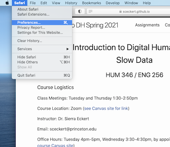
	- Then click on the "Advanced" Tab and check the box next to "Show Develop menu in menu bar"" 
	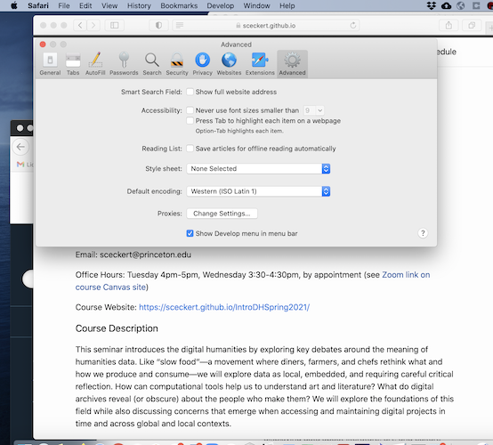
	- Then, click on the "Develop" menu and select "Show Web Inspector" 
	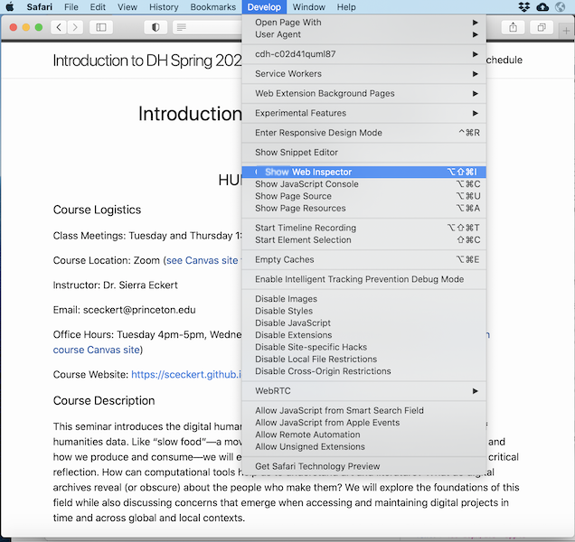

- **For Firefox**: 
	- Click on the "Tools" menu and select "Web Developer" and then select "Inspector" 
	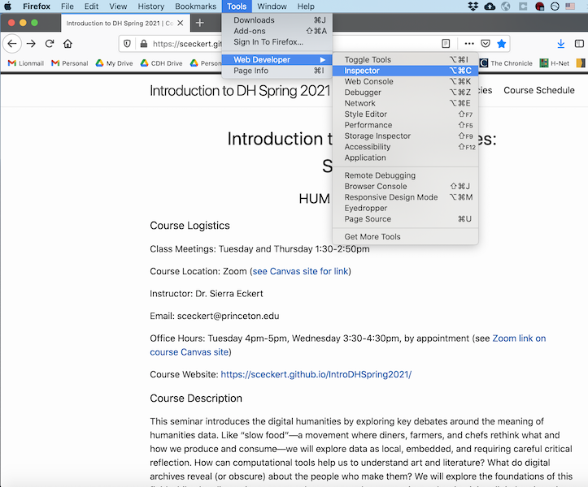

- **For Chrome:**
	- Click on the "View" menu and select "Developer" and then select "Inspect Elements" 
	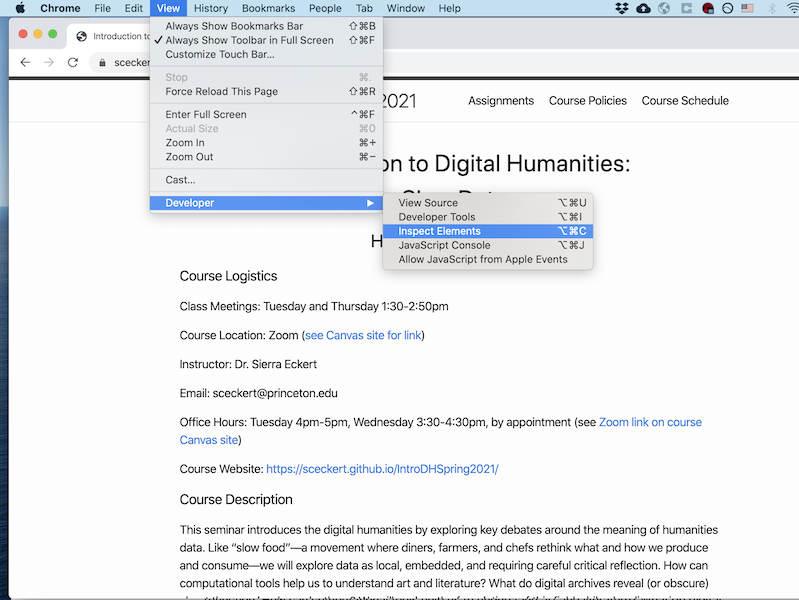


Once you've followed the steps, what you should be looking at is a console menu that pops up at the bottom of your page (for Firefox or Safari) or to the righthand side (for Chrome) with a number of panels including a panel with some HTML tags and text. 
- Safari: 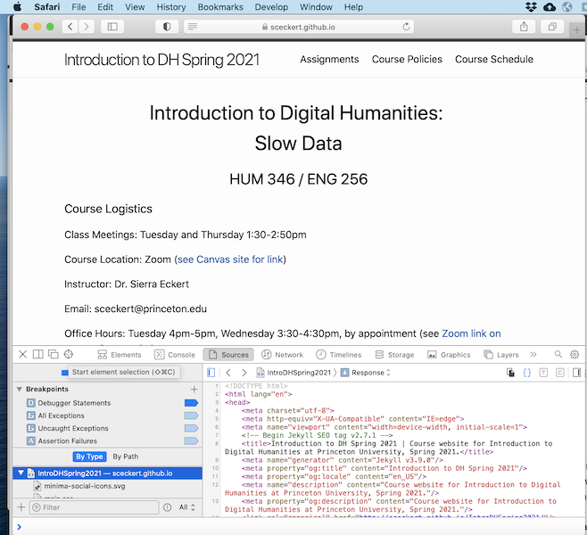
- Firefox: 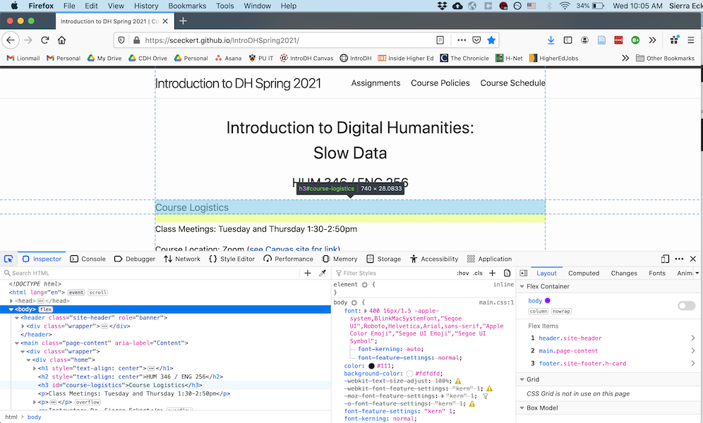
- Chrome: 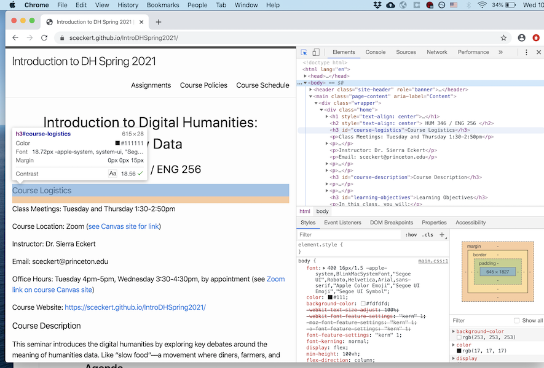


What you're looking at is **source code** for our course webpage. 

Let's look at one  with text, URL links and HTML "tags" enclosed in brackets `<` `>`. These tags tell the page how to render, and can be used to identify specific elements on the page. 


Look at the [handy overview of basic HTML elements.](https://www.w3schools.com/tags/ref_byfunc.asp) that we can use to create HTML elements.

Can you identify some of the parts of our course website? What element contains the course heading? 

Poke around and see if you can figure out what some of the different tags on our course webpage do. If you hover over a part of the webpage, it will display what that element's name. (**On Safari you have to click the small bullseye icon in the upper lefthand part of the console window** to enable this)

### Mini-Exercise: HTML Treasure Hunt

Hidden in the source code of our course webpage, I've included an invisible secret comment. Using your web inspector, try to find the comment!


## HTML and Web-Scraping

**Web-scraping** is a term for computationally collecting data from the internet. "Scrape," "crawl," "spider," and "robot" are all terms used to describe the process of automating the collection of data on the internet. This includes downloading the HTML files of webpages, as well as extracting information from web pages.

### The Ethics of Web-Scraping

We'll be talking more about this in class, but it's absolutely crucial to think about the ethical and legal questions around this method of data collection. Is it legal and ethical to collect data from the internet published by others? What degree of consent do you need from users for research?

A 2019 ruling by the Ninth Circuit court ruled that scraping publicly available databases (The Electronic Frontier Foundation wrote about the ruling in[ an article here](https://www.eff.org/deeplinks/2019/09/victory-ruling-hiq-v-linkedin-protects-scraping-public-data#:~:text=Linkedin%20Protects%20Scraping%20of%20Public%20Data,-Share%20It%20Share&text=In%20a%20long%2Dawaited%20decision,and%20Abuse%20Act%20(CFAA).))

For research involving human participants (this is especially applicable for social media scraping), the general recommendation is to err on the side of caution and request approval from the Institutional Review Board (in this case, Princeton's IRB) for research. 

Just because it may be legal to collect public data on the internet does not mean it is always ethical to do so. There are techniques for anonymizing data (including only excerpts). For a more in-depth study on the question of ethical and legal side of web scraping (and the often murky regulatory mechanism on the subject,) see this article by [this article by Casey Fiesler, Nathan Beard, and Brian C. Keegan](https://cmci.colorado.edu/~cafi5706/ICWSM2020_datascraping.pdf)

### Application Programming Interface (APIs)

Let's say you're a researcher interested in collecting some data from the internet. Maybe it's think a collection of tweets, a series of transcriptions of historic newspaper articles, a collection of library catalog entries. How would you go about collecting that data? You might start by thinking about trying to download webpages so that you could extract the text (or metadata), that you want.


Many organizations have what's called an **application programming interface (API)**. This is a way for you to use a URL like a souped up search bar.  can take the structure of URLs one step further: they allow you to use a URL to construct a query –-that is, a search request––to a database. An API is like a specialized search portal into a database associated with a website, and it's something that a company or institution sets up for a variety of reasons, including  commercial and research use. An API  query can look like a general search across the whole database, or a more targeted search by using certain controlled parameters. 

Lots of applications and organizations have created APIs for accessing, including:

- Twitter API 
- Genius API, the song lyrics database
- [Chronicling America API](https://chroniclingamerica.loc.gov/about/api/), an API created by the Library of Congress for collecting data from their Chronicling America Historic Newspapers database  (this API does not require registration)
- [Princeton Art Museum API](https://github.com/Princeton-University-Art-Museum/puam-api-docs) (this API does not require registration). The PU Art Museum includes documentation on the different parameters for searching the API. 


### Registering for the Genius API

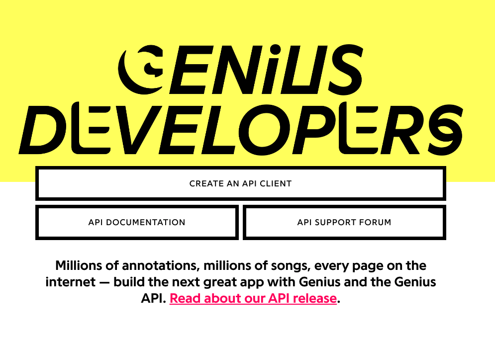

We're going to be working with the Genius API in our practicum, which is built on the Genius database of song lyrics and annotations. Like many APIs, Genius corporation requires users to register for access. To use the API, you'll need something called a "client access token."


How to get your token:

1. First, sight up here: https://genius.com/api-clients. (You'l be redirected to Sign up for a Genius Account --- sign up for the account)/
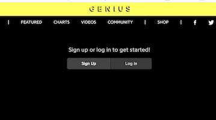
2. Click "New API Client"
3. You'll be prompted to fill out information about the app. Put "Song Lyrics Project” for the “App Name” and the URL for our course website “https://sceckert.github.io/IntroDHSpring2021/”
4. Click Save
5. You'll be presented with 2 keys. Click "Generate Access Token”. You will then see a "Client Access Token" -- copy and save this key somewhere you'll be able to find in class!! We'll be using it in class. 


## OpenRefine

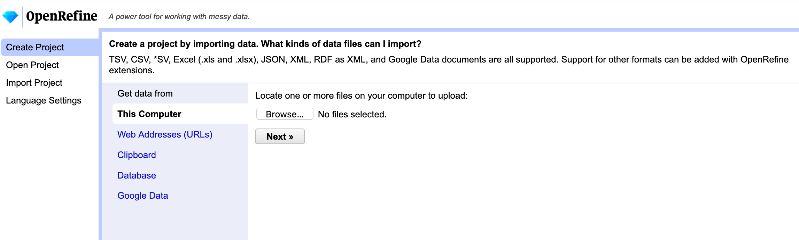

OpenRefine is a  open-source application for sorting, cleaning data, and building datasets. It has the very handy built-in capacity to interact with  APIs to let us create scripts that let us computationally download data from the web into a spreadsheet. 

OpenRefine is an application that runs in a web browser (like Jupyter notebooks and JupyterLab) *but* it stores all of your data, and data transformations locally––you're only ever interacting with the web when you are calling up a URL to download. We'll be learning more about what OpenRefine can do in class, but for now, follow the instructions below to download the program. 

### Download OpenRefine

1. Navigate to the OpenRefine [download page](https://openrefine.org/download.html)
2. Follow the instructions to download the OpenRefine (version 3.4.1) kit for your operating system. This will download the app installer for your operating system

- *NOTE*: OpenRefine requires the software Java. If you are on Windows, you will need to download a different version depending on whether or not you have Java. To check whether you have Java, open up PowerShell (your command line interface) and type `java -version`. You will either get an output with the line `java version "your version number"` or nothing. If nothing is returned, this means you don't have Java on your machine.


