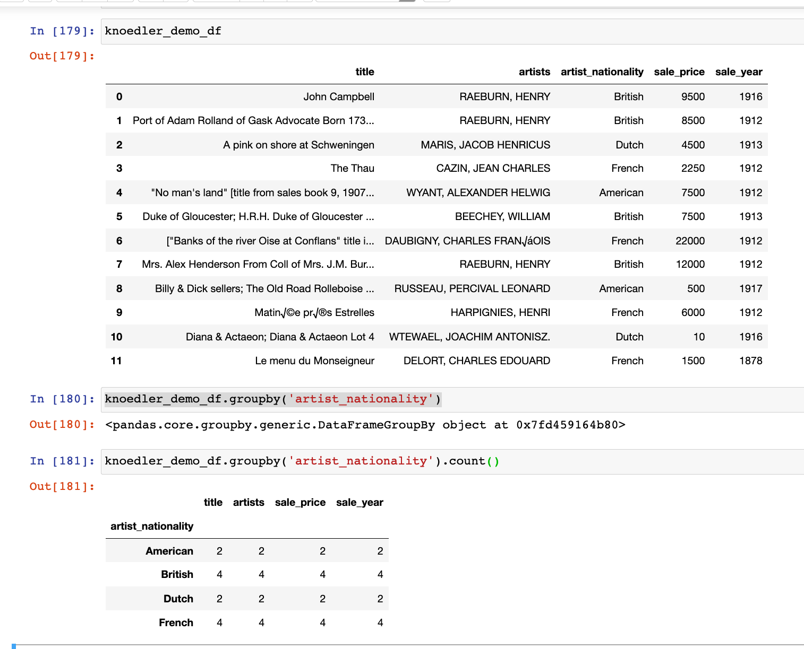
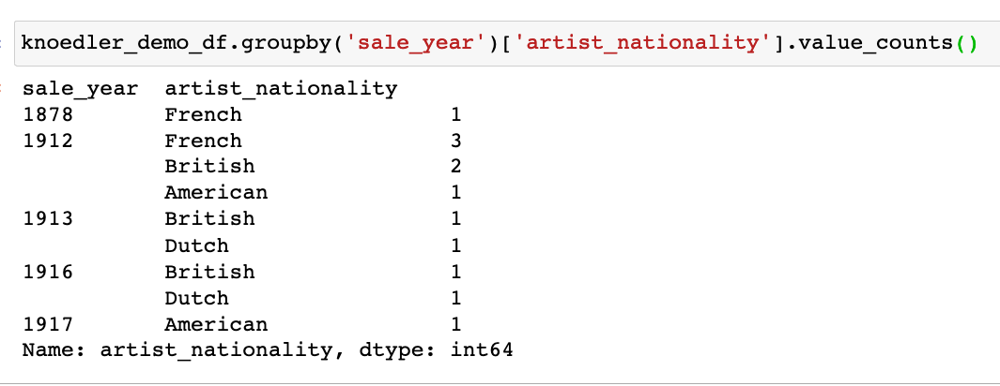
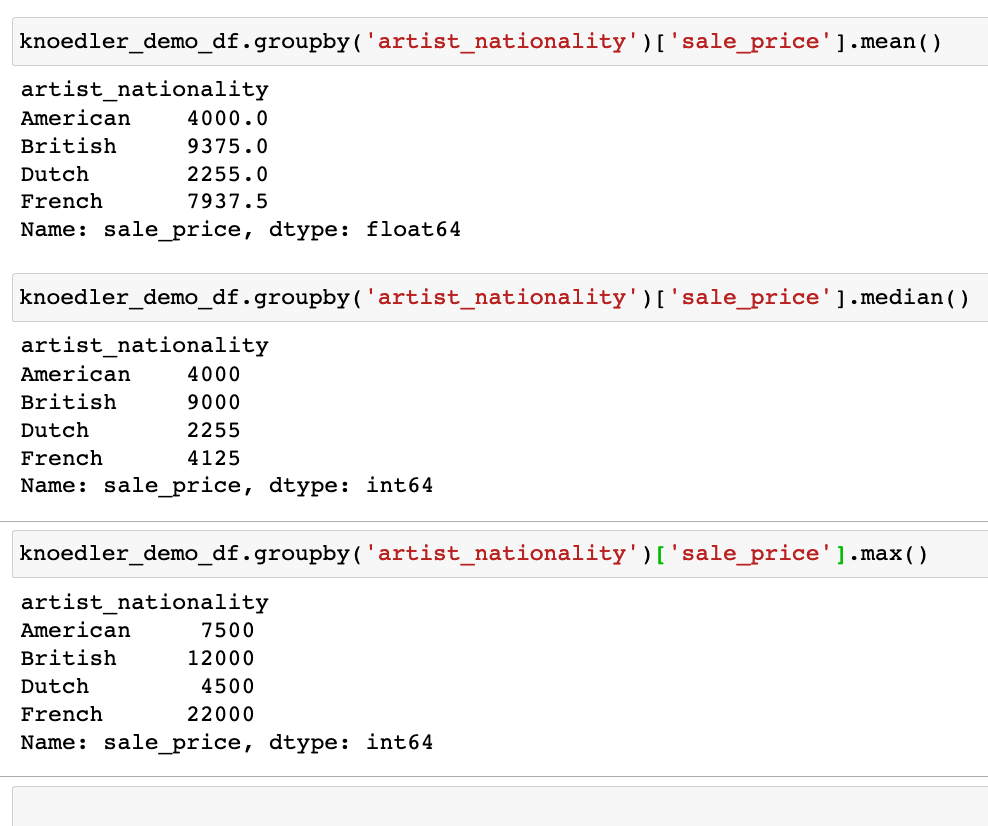
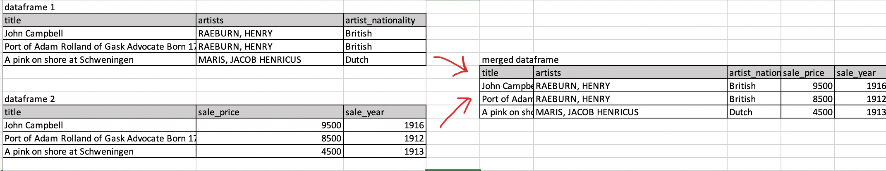

# Homework for Week 7: Hunches, Hypotheses, and Exploratory Data Analysis

So far we've learned how to think about datasets in all of their rich contexts, how turn sources into datasets, and how to collect data by hand and through webscraping tools like OpenRefine. We've also learned the basics of Python, and Jupyter notebooks to analyze and clean data, ands we've learned 

In this week's homework, we're going to put some of this together. We're going to practice turning specific research questions into hunches that we can test out using what we've learned so far in pandas. We'll be working with a single dataset,  we're going to translate research questions into concrete actions  This homework will set you up for the first part of an exercise. **This is just the first part: We'll complete together in class.**

## Let's refresh ourselves on what we've learned!

Take a few minutes to refresh yourself and try and try and answer the following questions (no need to record your answers, this is just for you)

- Jupyter notebooks
	- How do we make a Jupyter notebook? open it? rename it? save it? how do we import Pandas?
- Pandas
	- How do we read in a csv? what is a dataframe? what is a column (or "series")"? how do we select columns and rows? how do we rename columns or create new ones?
	- How do we sort data? how do we filter data? how can we drop data? how can we aggregate data?

If it helps, look back at the sequence of our lessons on these topics: 

- Videos on using Jupyter notebooks:
	- [How to run a Jupyter notebook on Anaconda Navigator](https://princeton.zoom.us/rec/share/1uLtbi2UisC7Pl3ahYY8ZPEOpEvmV1xQpnPFVtze6DLDL9jrSQLEqZvlWx2r1XZT.7t57DUBTKoWewi-a?startTime=1614894075000)
	- [Pro tips for using Jupyter notebooks (and some additional pandas tips)](https://princeton.zoom.us/rec/share/I7cTIhAELXlhL1mBVjuO12oYSFhy6g_ODaKPR_f23QEy5XXua-qzk2e_EwAwCkVh.Wrkvl1Em98fRXe1j?startTime=1614896446000)
- Python and pandas in class practicums and homework: 
	- [Introduction to Metadata](https://github.com/sceckert/IntroDHSpring2021/blob/main/_week3/introduction-to-metadata.ipynb) | [interactive version](https://mybinder.org/v2/gh/sceckert/introdhspring2021/main?urlpath=lab/tree/_week3/introduction-to-metadata.ipynb)
	- [Introduction to Python Basics](https://github.com/sceckert/IntroDHSpring2021/blob/main/_week4/introduction-to-python.ipynb) | [interactive version](https://mybinder.org/v2/gh/sceckert/introdhspring2021/main?urlpath=lab/tree/_week4/introduction-to-python.ipynb)
	- [Homework 3: Working with Data in Python](https://github.com/sceckert/IntroDHSpring2021/blob/main/_week4/homework-3.ipynb) | [interactive version](https://mybinder.org/v2/gh/sceckert/introdhspring2021/main?urlpath=lab/tree/_week4/homework-3.ipynb)
	- [Introduction to Python (Continued)](https://github.com/sceckert/IntroDHSpring2021/blob/main/_week4/introduction-to-python-continued.ipynb) | [interactive version](https://mybinder.org/v2/gh/sceckert/introdhspring2021/main?urlpath=lab/tree/_week4/introduction-to-python-continued.ipynb) 
	- [Introduction to Python: Pandas](https://github.com/sceckert/IntroDHSpring2021/blob/main/_week5/python-continued.ipynb) | [interactive version](https://mybinder.org/v2/gh/sceckert/introdhspring2021/main?urlpath=lab/tree/_week5/python-continued.ipynb)

## More Advanced Pandas

There are a few more advanced pandas techniques that will come in handy for today's homework and for our in-class work on Thursday.

### Refrefsher on `groupby()` 

`groupby()` as we've learned in early lessons on pandas, is a powerful operation that allows us to to sort data 

Pandas documentation for using groupby [https://pandas.pydata.org/pandas-docs/stable/user_guide/groupby.html]

For instance, take this small sample data from NYC Knoedler dataset. We can dataframe 

`knoedler_demo_df = pd.read_csv('../knoedler-data-demo.csv', encoding='utf-8')`

`knoedler_df`_ 

We could run `groupby('artist_nationality).counts()` to count the number of non-NaN rows that with each given artist nationality

Or we could group by "artist_nationality",  filter by "sale price", and calculate the TOTAL value of arworks sold by artists of each nationality.

Or we could group by "sale_year_",  filter by "sale_price", and calculate the TOTAL value of arworks sold in each year.

Or we could group by "sale_year_",  filter by "artist_nationality", and calculate then number of paintings sold by artists of each nationality in each year. 

Or we could could group by "artist_nationality", filter by "sale_price"  and calculate the mean, median, and maximum sale prices  for artworks for each nationality

### `merge()` 

Sometimes your research data will be spread out across several different CSV files. Luckily enough, pandas has the capacity to bring different data frames into a single dataframe. The `merge()` operation allows us to combine two different data frames by "merging" along a shared key.

For instance, if we had two data frames, `dataframe1` and `dataframe2`, each of which shared a single column in common (a "key" column), we can merge on that column.

`pd.merge(dataframe1, dataframe2, on='title')`

### `plot()` 

We've already seen some and pandas plotting functions (see [Introduction to Python: pandas, Exercise 2](https://mybinder.org/v2/gh/sceckert/introdhspring2021/main?urlpath=lab/tree/_week5/python-continued.ipynb)

The plot function has several basic plotting operations operations. Skim through the plotting documentations to learn more about how to create the differentkinds of visualizations: stacked bar charts, scatter plots, chart, etc: [https://pandas.pydata.org/pandas-docs/stable/user_guide/visualization.html](https://pandas.pydata.org/pandas-docs/stable/user_guide/visualization.html)

## Part 1: From exploratory data analysis to a research hypothesis

For this exercise, we're going to be working with the film dialogue dataset behind *The Pudding'*s 2017 article, ["Film Dialogue from 2,000 screenplays, Broken Down by Gender and Age"](https://pudding.cool/2017/03/film-dialogue/)

Read up on background behind the choices in the "Film Dialogue, By Gender" project here: [https://medium.com/@matthew_daniels/faq-for-the-film-dialogue-by-gender-project-40078209f751](https://medium.com/@matthew_daniels/faq-for-the-film-dialogue-by-gender-project-40078209f751)

1. Download the three datasets from [this zip file](https://github.com/sceckert/IntroDHSpring2021/blob/main/_datasets/pudding-film-dialogue-data.zip?raw=true). These scripts are from Matt Daniels's [Github repo](https://github.com/matthewfdaniels/scripts/), take a look inside the documentation files to see what each contain
2. Launch Anaconda Navigator, Launch JupyterLabs and create a new Jupyter notebook 
3. Read in each of the CSV files as a dataframe. The *Pudding*'s data has a slightly different encoding, so make sure to specify `encoding = "ISO-8859-1")` when you load them in
4. Once you've loaded in each CSV, take a look at what you find. See if there is any missing data

### Planning how to translate research questions into computational analysis

These datasets were originally created for a specific set of research questions about gender in films, but there's enough data here that we could think about other research questions we could ask 

Think about how you would answer the following questions. Write down some thoughts in plain English (not Python) describing in layman's terms what you would have to do answer these questions: 

1. How could we tell if the amount of dialogue (by gender breakdown and total), was increasing over time in movies? How might this influence the assessment about the breakdown of gender dialogue?
2. How could you test if there was any relationship between the film's gross value and the amount of dialogue in the film?

### Generating a hypothesis and testing it out

1. How would you visualize one of the research questions above? (In plain English)
2. What do you *hypothesize* your a visualization would look like? 

### Reflections

How is a research question different from a testable, exploratory hypothesis? Reflect on how you had to change your research question in order to turn it into something that you could test out or explore computationally  

1. What other research questions would you want to explore in this dataset?
2. How could you turn those research questions into testable hypotheses?

Part 2 we will complete together in class!